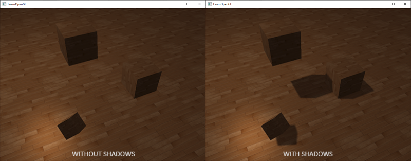

# Shadow mapping
Cienie są ważnym elementem oświetlenie. Dodają realizmu do sceny i dzięki nim łatwiej jest graczowi zorientować się w przestrzennym rozłożeniu obiektów. 

Na powyższym obrazku możesz zobaczyć, że dużo łatwiej jest okreśłić położenie kostek, gdy rzucają one cienie. Podstawową techniką generowania cieni jest **shadow mapping** i wiele bardziej zaawansowanych technik na niej bazuje. 

Składa się on z dwóch kroków. W pierwszym obliczamy mapy głębokości z perspektywy źródła światła i zapisaniu do tekstury (tą teksturę nazywamy *shadowmap*), w drugim przy rysowaniu fragmentu porównujemy jego odległość do źródła światła z odległością zapisaną w teksturze. 

Celem tych zajęć będzie dodanie cieni do początkowej sceny. W obecnym projekcie są 3 źródła światła: światło słoneczne, reflektor samolociku i lampa planetarna. W trakcie zajęć skupimy się na świetle słonecznym. 

## Mapa głębokości - Framebuffers
Framebuffer to obiekt, do którego rednerowana jest scena w postaci tekstury. Do tej pory korzystaliśmy z domyślnego Famebuffora, który był wyświetlany na ekranie. Teraz potrzebujemy dodatkowy, który będzie przechwytywał mapę głębokości. Tworzymy go w następujący sposób

```C++
glGenFramebuffers(1, &depthMapFBO);  
```
Zmienna `depthMapFBO` jest jak to typu `unsignet int` i powinna być dostępna globalnie. Kolejnym krokiem jest stworzenie tekstury głębokości
```C++
glGenTextures(1, &depthMap);
glBindTexture(GL_TEXTURE_2D, depthMap);
glTexImage2D(GL_TEXTURE_2D, 0, GL_DEPTH_COMPONENT, 
             SHADOW_WIDTH, SHADOW_HEIGHT, 0, GL_DEPTH_COMPONENT, GL_FLOAT, NULL);
glTexParameteri(GL_TEXTURE_2D, GL_TEXTURE_MIN_FILTER, GL_NEAREST);
glTexParameteri(GL_TEXTURE_2D, GL_TEXTURE_MAG_FILTER, GL_NEAREST);
glTexParameteri(GL_TEXTURE_2D, GL_TEXTURE_WRAP_S, GL_REPEAT); 
glTexParameteri(GL_TEXTURE_2D, GL_TEXTURE_WRAP_T, GL_REPEAT);  
```
Również zmienna `depthMap` jest jak to typu `unsignet int` i powinna być dostępna globalnie. 
Tworzymy teksturę, zaznaczamy, że jest to tekstura głębokości nadając jej format `GL_DEPTH_COMPONENT`. Parametry `SHADOW_WIDTH`, `SHADOW_HEIGHT` są ustalone globalnie i oba wynoszą 1024.

I w końcu podpinamy teksturę pod FBO. 
```C++

glBindFramebuffer(GL_FRAMEBUFFER, depthMapFBO);
glFramebufferTexture2D(GL_FRAMEBUFFER, GL_DEPTH_ATTACHMENT, GL_TEXTURE_2D, depthMap, 0);
glDrawBuffer(GL_NONE);
glReadBuffer(GL_NONE);
glBindFramebuffer(GL_FRAMEBUFFER, 0);  
```

### Zadanie 
Utwórz funkcję `initDepthMap`, w której zainicjalizujesz mapę głębokości. Wywołaj ją w funkcji `init`.  

### Renderowanie mapy głębokości

W tej części będziemy uzupełniać funkcję `renderShadowapSun`. Funkcja ma za zadanie zapisać w FBO mapę głębokości z perspektywy słońca. 
Pierwsze co musimy mieć, to parę shaderów, która będzie renderować mapę. Ponieważ jedyne co potrzebujemy tylko rozmieścić obiekty w odpowiednich miejscach.
Shader wierzchołków ustawia tylko pozycję w oparciu o przesyłanie macierze.
```C++
#version 430 core

layout(location = 0) in vec3 vertexPosition;
layout(location = 1) in vec3 vertexNormal;
layout(location = 2) in vec2 vertexTexCoord;

uniform mat4 viewProjectionMatrix;
uniform mat4 modelMatrix;

void main()
{
	gl_Position = viewProjectionMatrix * modelMatrix * vec4(vertexPosition, 1.0);
}
```
Natomiast shader fragmentów jest pusty, ponieważ nic nie wysyłamy a głębokość zapisywana jest automatycznie.
```C++
#version 430 core

void main()
{             
}  
```
### Zadanie
Dodaj utwórz parę shaderów jak powyżej, załaduj je do zmiennej globalnej o nazwie `programDepth` i aktywuj go w funkcji `renderShadowapSun`. Utwórz funkcję `drawObjectDepth`. która będzie przyjmować referencję do `RenderContext`, macierz `viewProjection` i macierz modelu oraz przesyłać macierze do GPU i rysować `RenderContext` 

Musimy zdefiniować macierz widoku i rzutowania, które mamy przesłać. Implementujemy cienie dla oświetlenia kierunkowego, gdzie dla każdego punktu kierunek światła jest taki sam. W takim wypadku skorzystamy z rzutowania prostopadłego. 


Do stworzenia macierzy rzutowania perspektywicznego wykorzystamy funkcję:
```C++
glm::mat4 lightProjection = glm::ortho(
	float left,
	float right,
	float bottom,
	float top,
	float zNear,
	float zFar
)
```
Tworzy ona macierz rzutowania prostopadłego dla zadanych wymiarów. Musimy tak je dobrać, żeby rzutowanie zawierało całą interesującą scenę. Za małe wartości spowodują artefakty a za duże pogorszą jakość. Przykładowo możesz wziąć `glm::ortho(-10.f, 10.f, -10.f, 10.f, 1.0f, 30.0f)`.
Do stworzenia macierzy kamery wykorzystamy funkcję `glm::lookAt` z poniższymi argumentami argumentami
```C++
glm::lookAt(sunPos, sunPos - sunDir, glm::vec3(0, 1, 0))
```
### Zadanie 
Uzupełnij funkcję `renderShadowapSun`. Wywołaj w niej instrukcje
```C++
	//ustawianie przestrzeni rysowania 
	glViewport(0, 0, SHADOW_WIDTH, SHADOW_HEIGHT);
	//bindowanie FBO
	glBindFramebuffer(GL_FRAMEBUFFER, depthMapFBO);
	//czyszczenie mapy głębokości 
	glClear(GL_DEPTH_BUFFER_BIT);
	//ustawianie programu
	glUseProgram(programDepth);
```
Stwórz macierz `viewProjection`
```C++
	glm::mat4 lightVP = glm::ortho(-10.f, 10.f, -10.f, 10.f, 1.0f, 30.0f) * glm::lookAt(sunPos, sunPos - sunDir, glm::vec3(0, 1, 0));
```
następnie wywołaj `drawObjectDepth` dla każdego obiektu, który rysujemy w naszej scenie. wykorzystaj macierz `viewProjection` zdefiniowaną wyżej, użyj tej samej macierzy modelu co przy właściwym rysowaniu.

Zakończ funkcję linią `glBindFramebuffer(GL_FRAMEBUFFER, 0);`, która przywraca domyślny FBO.

### Wizualizacja mapy głębokości
odkomentuj linie:
```C++
	//glClear(GL_COLOR_BUFFER_BIT | GL_DEPTH_BUFFER_BIT);
	//glUseProgram(programTest);
	//glActiveTexture(GL_TEXTURE0);
	//glBindTexture(GL_TEXTURE_2D, depthMap);
	//Core::DrawContext(models::testContext);
```
znajdujące się w `renderScene`. Rysują one prostokąt z mapą głębokości jako teksturą. Jeżeli wszystko zostało wykonane poprawnie, to powinien on zawierać rzutowanie naszego pokoju. 

### Zadanie 
W tej chwili rzutowanie jest nieoptymalne. popraw je na lepsze. Zmodyfikuj wartości w `glm::ortho(-10.f, 10.f, -10.f, 10.f, 1.0f, 30.0f)` do takich, żeby pokój wypełniał jak największą część tekstury.

### Rysowanie cieni
Na tym etapie powinniśmy mieć poprawnie stworzoną mapę głębokości. Pozostaje wykorzystać ją w oświetleniu. 
### Zadanie
#### Przesłanie danych
W funkcji `drawObjectPBR` prześlij teksturę za pomocą instrukcji:
```C++
	glActiveTexture(GL_TEXTURE0);
	glBindTexture(GL_TEXTURE_2D, depthMap);
```
oraz macierz `LightVP`, która musi być taka sama jak w `drawObjectDepth`.

Następnie w shaderze wierzchołków odbierz `LightVP`. 

#### Shader wierzchołków
Oblicz pozycję wierzchołka z perspektywy słońca  `sunSpacePos=LightVP*modelMatrix*vec4(vertexPosition,1)`, wynik prześlij do shadera fragmentów
#### Shader fragmentów
odbierz `sunSpacePos` i napisz funkcję `calculateShadow`, która sprawdza czy obiekt jest zacieniony. Aby to zrobić kolejno w funkcji:
* ujednorodnij zmienną `lightSpacePos` dzieląc ją przez współrzędną **w**,
* przeskaluj ją, ma wartości od -1 do 1 a potrzebujemy wartości od 0 do 1 (pomnóż przez 0.5 i dodaj 0.5) wynik zapisz do zmiennej `lightSpacePosNormalized`,
* pobierz głębokość z `depthMap` próbkuj za pomocą współrzędnych **x** i **y**. Pobierz tylko kanał `r`, zapisz go do zmiennej  `closestDepth`,
* porównaj `closestDepth` ze współrzędną **z** `lightSpacePosNormalized`. jeżeli  `closestDepth` jest większa zwróć 1.0, w przeciwnym wypadku zwróć 0.0.
* wynik funkcji przemnóż z `sunColor` w trakcie oblicznia.
```
	ilumination=ilumination+PBRLight(sunDir,sunColor,normal,viewDir);
```
#### shadow acne
Powinniśmy dostać cienie , jednak w niezacienionych strefach pojawiły się paski, które znane są jako *shadow acne* wynikają one z błędu przybliżenia liczb zmiennoprzecinkowych. Można się go pozbyć na dwa sposoby 
1. dodać bias. zamiast sprawdzać `closestDepth<lightSpacePosNormalized` można wziąć `closestDepth+bias>lightSpacePosNormalized`, gdzie `bias` to mała wartość (np 0.01).
2. innym rozwiązaniem jest, żeby przy renderowaniu cieni włączyć front face culling. dzięki temu rysowane będą część modelu, które są dalej niż te, które odpytujemy. 

### Zadanie*
Dodaj rysowane cieni również dla latarki doczepionej do statku. pamiętaj, że musisz wykorzystać tutaj macierz rzutowania perspektywicznego
